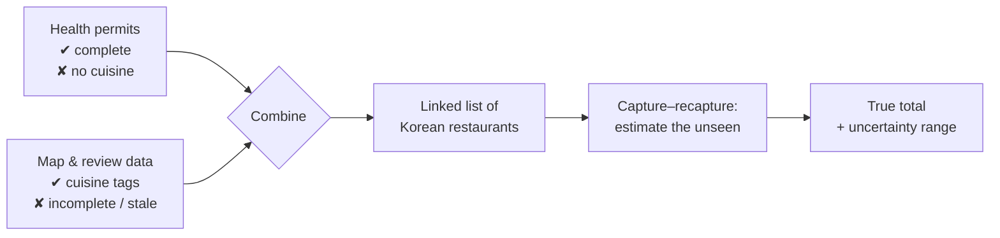
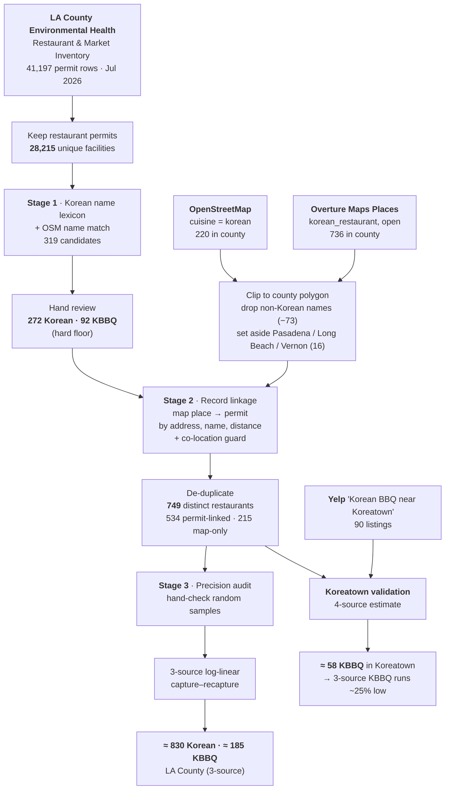
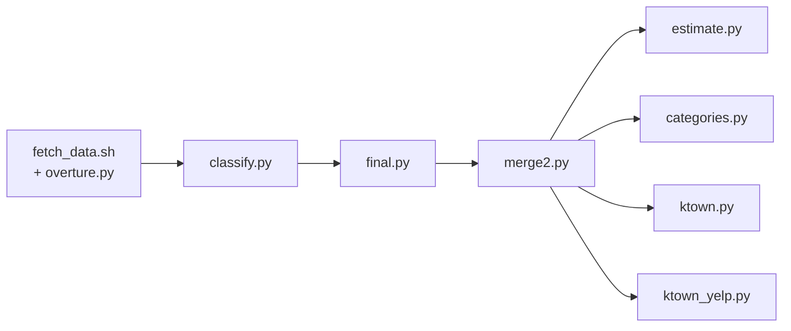
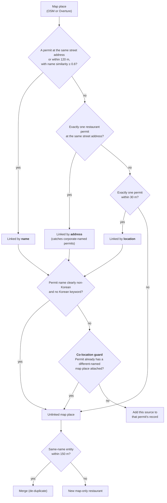
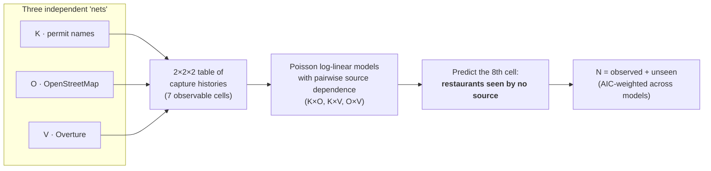
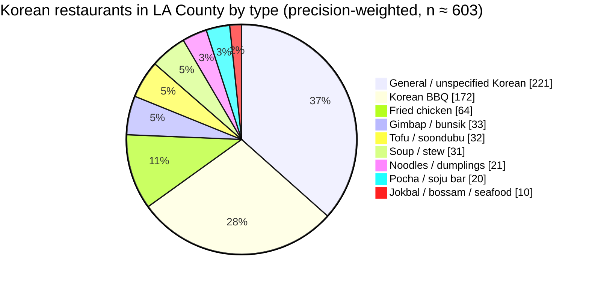
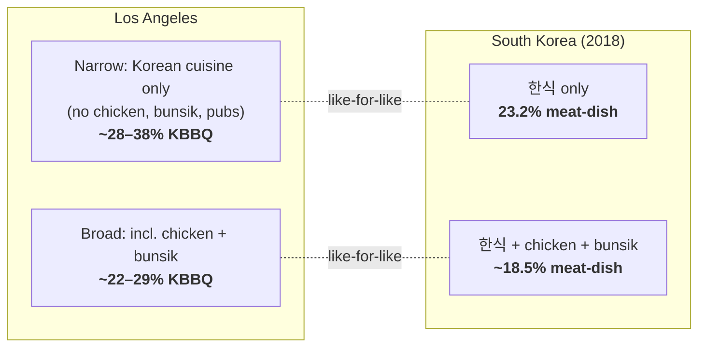
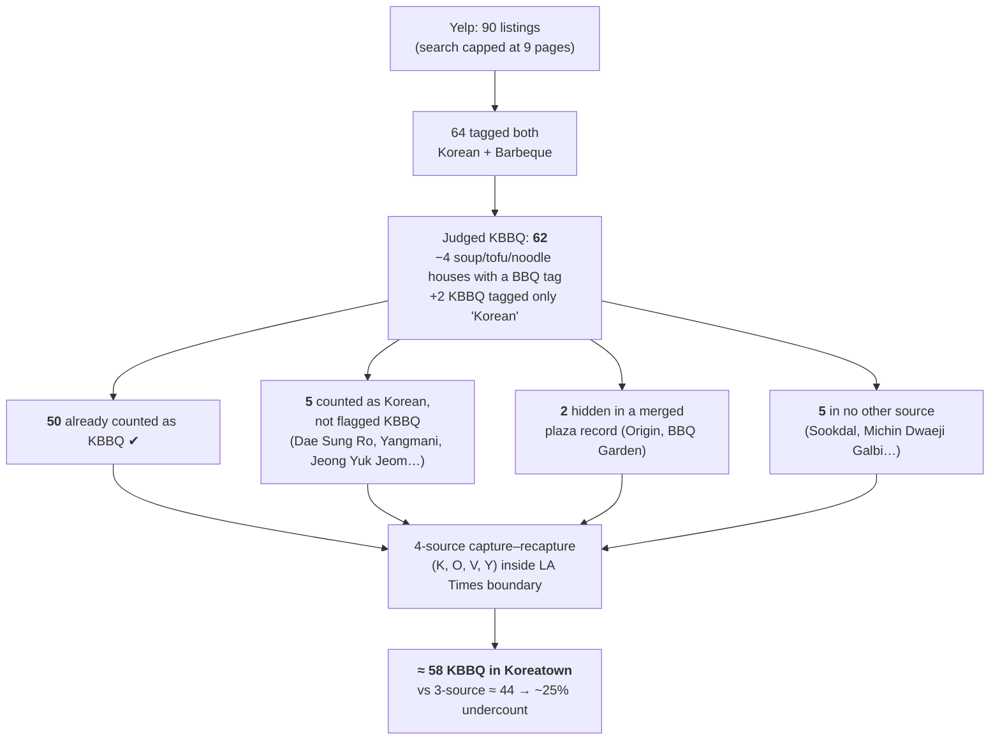

# How many Korean restaurants and Korean BBQ restaurants are in Los Angeles?

*(just for fun)*

An open, reproducible estimate built from public government permit data, two open map databases, and a Yelp check, with every step, number, and script included.

*Data pulled 2026-09-14. Author: Ace Savage.*

---

## Results

| Area | Korean restaurants | Korean BBQ (KBBQ) | KBBQ share |
|---|---|---|---|
| **Koreatown** — LA Times *Mapping L.A.* boundary (~2.7 sq mi) | **≈ 225** (200–235) | **≈ 58** (55–62) | **~26%** |
| **City of Los Angeles** (legal city limits) | **≈ 430** (370–450) | **≈ 97–125** | ~23–29% |
| **Los Angeles County** | **≈ 830** (model range ~670–850) | **≈ 185–240** | **~22–29%** |

- **Hard floor** (every restaurant individually confirmed by its health-permit name): **272 Korean, 92 KBBQ** countywide.
- In Koreatown, Korean restaurants are **~38% of all 597 restaurant permits**, and KBBQ is **about 1 in 10**.
- The Koreatown KBBQ figure has the strongest support: it adds Yelp as a fourth independent source ([§7](#7-koreatown-and-the-yelp-check)). The same check showed the three-source model undercounts KBBQ by about a quarter, which is why the city and county KBBQ figures are given as ranges.
- **Compared with South Korea:** on a like-for-like basis, LA's KBBQ share is about **1.2–1.6× Korea's** ([§6](#6-comparison-with-south-korea)).

---

## Contents
1. [The problem](#1-the-problem)
2. [Pipeline overview](#2-pipeline-overview)
3. [Stage 1 — Health permits and a name lexicon (the floor)](#3-stage-1--health-permits-and-a-name-lexicon-the-floor)
4. [Stage 2 — Adding two map databases and linking records](#4-stage-2--adding-two-map-databases-and-linking-records)
5. [Stage 3 — Checking accuracy and estimating what nobody saw](#5-stage-3--checking-accuracy-and-estimating-what-nobody-saw)
6. [Comparison with South Korea](#6-comparison-with-south-korea)
7. [Koreatown and the Yelp check](#7-koreatown-and-the-yelp-check)
8. [Dead ends and why they matter](#8-dead-ends-and-why-they-matter)
9. [Limitations](#9-limitations)
10. [Reproduce it](#10-reproduce-it)
11. [Sources](#11-sources)

---

## 1. The problem

No agency publishes a count of restaurants **by cuisine**.

- **Health permits** list every legally operating restaurant but **not its cuisine**.
- **Map and review sites** tag cuisine but are **incomplete, stale, sometimes wrong**, and Yelp caps every search at 90 results.

The approach: use permits as the ground truth for *"this restaurant exists,"* use map and review databases as evidence for *"this restaurant is Korean,"* and use statistics to estimate the Korean restaurants **none** of the sources caught.



---

## 2. Pipeline overview



Scripts run in this order (all in [`pipeline/`](pipeline/)):



---

## 3. Stage 1 — Health permits and a name lexicon (the floor)

**Source:** LA County Department of Public Health, *Environmental Health Restaurant and Market Inventory* (07/01/2026 snapshot). It covers every permitted food facility in the county **except Pasadena, Long Beach and Vernon**, which run their own health departments.

1. Keep permits whose type starts with `RESTAURANT` → **28,215** unique facilities.
2. Flag names containing Korean food terms, Korean place names or known Korean chains (galbi, bulgogi, soondubu, tofu house, gimbap, pocha, Seoul, Gangnam, Baekjeong, BCD, Kyochon, …). Also flag permits within 150 m of an OpenStreetMap place tagged `cuisine=korean` whose name shares a word with the permit. → **319 candidates**
3. Remove false positives by hand: Sam Woo (Chinese BBQ), Boiling Crab *Ktown*, Beard Papa's *K-Town*, a Korean Air lounge, and so on. → **272 Korean**
4. Mark KBBQ: a Korean restaurant whose name signals table grilling (BBQ, galbi, gogi, samgyeopsal, gopchang…) or that is a known KBBQ brand. Exclude bb.q Chicken (a fried-chicken chain) and BBQ+Rice (rice bowls). → **92 KBBQ**

### Why this is only a floor

A known-name test showed that **many famous KBBQ restaurants have no health permit under their public name**. They are permitted under a corporate or legal name, so a name search cannot find them:

| Restaurant | Permits found under this name |
|---|---|
| Baekjeong, Gen, Road to Seoul, Oo-Kook, Hae Jang Chon, Sun Ha Jang, Moohan… | ✔ found |
| **Quarters, Honey Pig, Ham Ji Park, Hanjip, Gwang Yang, Eight Korean BBQ, Magal** | **✘ 0 permits** |

A simple two-source capture–recapture on Stage 1 alone gave ~450 Korean and ~113 KBBQ. The next stages showed that was far too low.

---

## 4. Stage 2 — Adding two map databases and linking records

| Source | What it gives | Filter used | In LA County |
|---|---|---|---|
| **OpenStreetMap** (Overpass API) | volunteer `cuisine=` tags | `cuisine` contains `korean` | 220 |
| **Overture Maps Places** (release 2026-08-19.0) | machine-assigned categories + open/closed status | primary category `korean_restaurant` (or alternate + a restaurant primary), not `permanently_closed`, confidence ≥ 0.5 | 736 |

Then:
- Clip to the Census TIGER **LA County polygon**.
- Drop places whose names are clearly not Korean (−73). The biggest offender was the Flame Broiler chain, which Overture tags as Korean *and* barbecue; the others were pho, sushi, katsu, Chinese BBQ, taco places and similar.
- Set aside places in Pasadena, Long Beach and Vernon (16), which have no county permit to link to.

### Record linkage: attaching each map place to a permit

This step catches restaurants permitted under corporate names: an address match works even when the names differ. It also guards against the opposite error, merging several restaurants that share one plaza address.



Name similarity is the larger of (a) the word overlap after dropping generic words and (b) a character-level similarity ratio, so romanization variants such as *Beul/Byul Gopchang* and *Sootbulljip/Soot Bull Jeep* still match. Korean-script names within 40 m of a linked restaurant are merged with it.

| Link method | OSM | Overture |
|---|---|---|
| by name | 121 | 357 |
| by address only | 17 | 116 |
| by location only | 8 | 13 |
| split off by co-location guard | 0 | 25 |
| rejected (non-Korean permit) | 9 | 17 |
| unlinked | 50 | 159 |

**Result: 749 distinct restaurants** seen by at least one source: 534 tied to an active permit and 215 map-only. 442 fall inside the City of LA boundary.

Each restaurant gets a **capture history**: which sources saw it.

- **K** — Korean keyword in the health-permit name (Stage 1)
- **O** — tagged Korean in OpenStreetMap
- **V** — tagged Korean in Overture
- **Y** — Yelp (Koreatown KBBQ check only, §7)

---

## 5. Stage 3 — Checking accuracy and estimating what nobody saw

### 5a. Precision audit

Map data contains errors: wrong cuisine, closed places, duplicates. I hand-checked random samples of roughly 40 records from each record type:

| Record type | Share confirmed real | Typical errors |
|---|---|---|
| Permit-name hits (K) | ~100% | (each reviewed by hand) |
| Map-only, linked to a permit, one source | ~80% | Japanese/Vietnamese places, stale address matches |
| Map-only, linked, seen by OSM | ~90% | |
| Map-only, no permit link (incl. co-location splits) | ~55% | duplicates, closed places, non-restaurants |
| KBBQ flagged only by map data | ~60–72% | Armenian or Chinese BBQ, diners |

Each restaurant is weighted by the rate for its record type.

### 5b. Capture–recapture

This is the method ecologists use to count fish. If three independent nets each catch some fish, **how much the catches overlap** tells you how many fish none of the nets caught.



Observed capture histories countywide (1 = seen by that source):

| K O V | 001 | 010 | 011 | 100 | 101 | 110 | 111 |
|---|---|---|---|---|---|---|---|
| Korean | 396 | 42 | 39 | 52 | 98 | 28 | 94 |
| KBBQ | 74 | 5 | 15 | 12 | 46 | 6 | 42 |

After precision weighting there are 606 likely-real Korean restaurants and 169 likely-real KBBQ.

| | Best model | Best-model estimate [95% CI] | **AIC-weighted estimate** | Range across 7 models |
|---|---|---|---|---|
| Korean, county* | K×O + K×V | 834 [741–992] | **≈ 815** | 656–834 |
| KBBQ, county* | K×O | 179 [175–187] | **≈ 181** | 175–184 |
| Korean, City of LA | K×O | 421 [401–450] | **≈ 431** | 372–448 |
| KBBQ, City of LA | K×O | 97 [94–103] | **≈ 97** | 94–98 |

\* Excludes Pasadena, Long Beach and Vernon. Map data shows about 13 Korean restaurants there (about 4 KBBQ), which brings the county totals to **≈ 830 Korean / ≈ 185 KBBQ**.

**Why the KBBQ figures are ranges:** the three-source model estimates *restaurants no source saw*, but it cannot fix *restaurants a source saw without recognizing them as KBBQ* (names with no BBQ cue, such as Dae Sung Ro or Yangmani). The Yelp check in Koreatown (§7) measured this: the three-source KBBQ figure was about 25% low. Applying that as an upper bound gives **185–240 countywide** and **97–125 in the City of LA**. The true correction outside Koreatown is probably smaller, because suburban KBBQ places more often say "BBQ" in their names and fewer share plaza addresses.

### 5c. KBBQ share by category

| Measure | KBBQ share |
|---|---|
| Overture category tags | 21.2% (143 / 676) |
| OpenStreetMap cuisine tags | 13.7% (29 / 212), since volunteers often omit a second cuisine tag |
| Permit names | 33.8% (92 / 272), biased high because KBBQ names usually say "BBQ" |
| Merged, precision-weighted list | 28.5% |
| **Model-adjusted total** | **~22–29%** |



Categories come from name keywords, so this breakdown is approximate.

---

## 6. Comparison with South Korea

**Source:** Statistics Korea, *National Business Survey* 2018 (10th KSIC revision), as tabulated in the Ministry of Agriculture, Food and Rural Affairs (MAFRA) *2019 Restaurant Industry Outlook Index Report*, Table I-5.

| KSIC category (2018) | Establishments |
|---|---|
| Korean-cuisine restaurants (한식 음식점업), total | 313,562 |
| of which meat-dish specialty (한식 육류요리 전문점) | **72,878 → 23.2%** (2017: 21.8%, rising) |
| Fried-chicken shops (치킨 전문점) — *outside* the Korean-cuisine total | 36,791 |
| Gimbap & snack shops (김밥 및 기타 간이 음식점) — *outside* | 43,212 |

At first glance ~22% in LA versus 23% in Korea looks the same, but the categories differ. Korea counts chicken shops, snack shops and pubs **outside** "Korean cuisine," while the LA count includes them. Matching the definitions:



**Conclusion:** LA's KBBQ share is about **1.2–1.6× Korea's**. The true gap may be a little larger, because Korea's meat-dish category is broader than table-grill KBBQ (it also covers yukhoe and some braised dishes). One plausible reason: in Korea, grilled meat competes with everyday rice, stew, chicken and snack shops, while in LA, KBBQ is the signature experience that draws non-Korean diners.

---

## 7. Koreatown and the Yelp check

### Boundaries

Koreatown has no single official boundary, so both common definitions are shown:

- **LA Times *Mapping L.A.*** (via City of LA GeoHub): Beverly Blvd (N), Virgil Ave / Wilshire Pl / Westmoreland Ave (E), Olympic Blvd (S), Crenshaw Blvd / Wilton Pl (W). About 2.7 sq mi.
- **2010 LA City Council designation:** 3rd St (N), Vermont Ave (E), Olympic Blvd (S), Western Ave (W), plus the Western Ave corridor north to Rosewood Ave. I approximated this as a street-grid box of about 1.3 sq mi.

| Boundary | Restaurant permits | Korean (estimate) | KBBQ (estimate) | Korean share of permits |
|---|---|---|---|---|
| **LA Times Mapping L.A.** | 597 | **≈ 225** (200–235) | **≈ 58** (4-source, incl. Yelp) | ~38% |
| 2010 City Council (approx.) | 487 | ≈ 190 (166–196) | ≈ 35 (3-source), likely ~45 after the Yelp correction | ~38% |

Koreatown holds **about a quarter of LA County's Korean restaurants and KBBQ**. The Korean total agrees with an independent Yelp tally of Korean-category listings near Koreatown by price tier ($ 34 + $$ ≥ 90 + $$$ 53 + $$$$ 8 ≥ 185, realistic 200+).

### The Yelp check

A separate Yelp scrape (2026-09-14) of **"Korean BBQ" near Koreatown, Los Angeles** recorded all 9 result pages, which is Yelp's cap (90 listings), along with each listing's categories and neighborhood label ([`pipeline/yelp/`](pipeline/yelp/)). I matched every listing by hand to the pipeline's records, one-to-one:



What the check taught, and what changed as a result:

1. **Plaza addresses hide restaurants.** Several restaurants that share one street address (e.g. Quarters, Origin and Corea BBQ at 3465 W 6th St) had been merged into a single record. I added the co-location guard in §4, which split off 25 places.
2. **Some KBBQ has no BBQ cue in its name.** Neither permits nor map tags flag these, so the three-source model cannot recover them. That is why the city and county KBBQ figures are ranges.
3. **Yelp's own count is a floor.** Its search stops at 90 results, and about 11 KBBQ restaurants inside Koreatown appear in the other sources but not in Yelp's top 90.
4. **Fuzzy name matching needs human review.** An automatic matcher paired "Park's BBQ" with "8 Korean BBQ *Buena Park*". The final matching is hand-specified in [`ktown_yelp.py`](pipeline/ktown_yelp.py).

---

## 8. Dead ends and why they matter

| Tried | Outcome | Lesson |
|---|---|---|
| Web search for a published count | Only a 2022 *Time Out* article on a hand-picked chart of "70+" KBBQ restaurants, not a census | No authoritative count exists, which is why this repo exists |
| City of LA active business licenses (NAICS 722) | 12,466 restaurant licenses, but no cuisine field; keyword matching gave 141 Korean / 53 KBBQ | Same name-only blind spot as Stage 1 |
| Korean-surname owner matching | Too noisy (most owners are corporations; Lee/Han/Chang overlap with Chinese) | Useful only as a spot-check that turned up missed places (Master Ha, Goopojib…) |
| Foursquare Open Source Places | Now gated behind login and terms; public S3 bucket emptied | Would have made a fifth source |
| Overpass main server | Overloaded | Used the maps.mail.ru mirror |
| Automatic fuzzy matching to Yelp | Paired unrelated restaurants | Replaced with a hand-specified one-to-one mapping |

---

## 9. Limitations

- **Precision rates come from roughly 40-record hand audits** per record type. This is the largest source of uncertainty for the Korean totals; ±10 percentage points of precision moves the county Korean total by roughly ±60.
- **KBBQ classification.** Outside Koreatown there is no fourth source to catch KBBQ with non-BBQ names. The 25% correction measured in Koreatown is treated as an upper bound.
- **Capture–recapture assumptions.** Sources are assumed to capture restaurants with pairwise (not three-way) dependence. Restaurants that are hard to see in *every* source, such as tiny food-court stalls with generic names, are probably still under-counted.
- **"Korean" and "KBBQ" are judgment calls.** Korean-Mexican fusion, Korean-Chinese (jjajang), Korean-owned non-Korean restaurants and bingsu/dessert cafés were excluded. KBBQ means table-grill style (including gopchang); fast-casual "BBQ bowl" shops were excluded.
- **Yelp data** are one search on one date, and Yelp's categories are self-reported by businesses.
- **Permits ≠ open doors.** The permit list is current as of July 2026, but a few permits may belong to recently closed businesses.
- The Council Koreatown boundary is a street-grid approximation.
- Korea's figures are from 2018, the latest year I could find broken out by subcategory.

---

## 10. Reproduce it

```bash
git clone https://github.com/acesava/la-korean-restaurants && cd la-korean-restaurants
python -m venv .venv && source .venv/bin/activate && pip install -r requirements.txt
cd pipeline
bash fetch_data.sh        # optional: re-download inputs (snapshots are already included)
python classify.py        # Stage 1 candidates
python final.py           # Stage 1 verified list + 2-source estimate
python merge2.py          # Stage 2 linkage, co-location guard, de-duplication
python estimate.py        # Stage 3 precision-weighted capture–recapture
python categories.py      # KBBQ share by category
python ktown.py           # Koreatown subset (3-source)
python ktown_yelp.py      # Koreatown KBBQ with Yelp as a 4th source
```

Outputs:
- [`results/la_korean_restaurants_verified.csv`](results/la_korean_restaurants_verified.csv): the 272 permit-verified Korean restaurants, with a KBBQ flag.
- [`results/la_korean_restaurants_all_sources.csv`](results/la_korean_restaurants_all_sources.csv): all 749 restaurants with source flags (K/O/V), KBBQ flag and City of LA flag.
- [`results/estimates.json`](results/estimates.json) and [`results/ktown_yelp_estimate.json`](results/ktown_yelp_estimate.json): model outputs.

All hand decisions (false-positive lists, KBBQ overrides, Yelp mapping) are written out in [`final.py`](pipeline/final.py), [`merge2.py`](pipeline/merge2.py) and [`ktown_yelp.py`](pipeline/ktown_yelp.py).

---

## 11. Sources

- LA County Department of Public Health — [Environmental Health Restaurant and Market Inventory](https://data.lacounty.gov/datasets/4f31c9a99e444a40a3806e3bbe7b5fdd) (07/01/2026 snapshot).
- © [OpenStreetMap](https://www.openstreetmap.org/copyright) contributors, via the Overpass API (ODbL).
- [Overture Maps Foundation](https://overturemaps.org/): Places theme, release 2026-08-19.0 (CDLA-Permissive-2.0).
- Yelp search results, "Korean BBQ" and Korean category near Koreatown, Los Angeles, CA, retrieved 14 Sept. 2026 (listing names, categories and neighborhood labels only).
- U.S. Census Bureau — [TIGERweb](https://tigerweb.geo.census.gov/) boundaries for LA County (06037) and the City of Los Angeles (0644000).
- Los Angeles Times *Mapping L.A.* — [LA Times Neighborhood Boundaries](https://geohub.lacity.org/datasets/la-times-neighborhood-boundaries), City of Los Angeles GeoHub.
- [Koreatown, Los Angeles](https://en.wikipedia.org/wiki/Koreatown,_Los_Angeles) — Wikipedia (boundary descriptions).
- Statistics Korea, *National Business Survey* 2018, via MAFRA, [*2019 Restaurant Industry Outlook Index Report*](https://www.mafra.go.kr/bbs/home/798/575903/download.do), Table I-5.
- National Tax Service statistics via [Hankyung](https://www.hankyung.com/article/202609118400g) (403,299 Korean-cuisine operators, July 2026): context only.
- Nitiyanandan, R., via [*Time Out Los Angeles*](https://www.timeout.com/los-angeles/news/this-viral-data-visualization-chart-ranks-l-a-kbbq-restaurants-by-cost-and-popularity-022822) (2022): the only prior published figure (70+ KBBQ analyzed).
- Methods: Chapman estimator; Fienberg (1972), "The multiple recapture census for closed populations and incomplete 2^k contingency tables," *Biometrika* 59(3).

Licenses: see [LICENSE.md](LICENSE.md). Code is MIT; the combined data is ODbL because it includes OpenStreetMap data.
